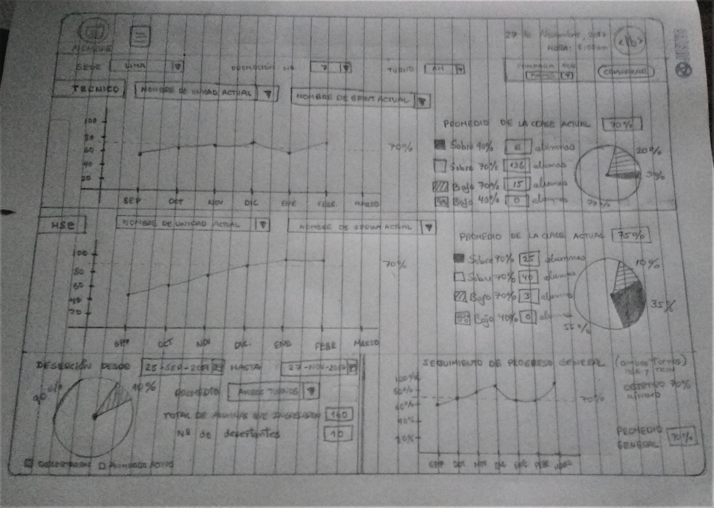
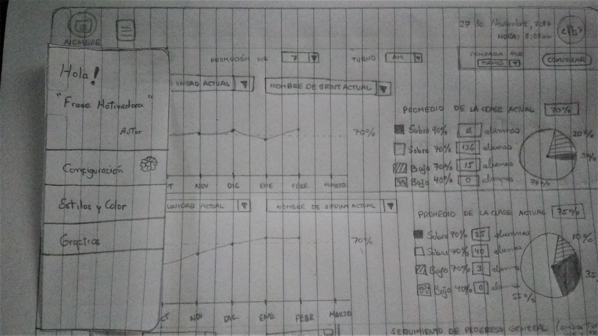

# Dashboard - sketch

***

## Descripción

* La ventana estará compuesta en 4 partes : `técnico`, `HSE`, `deserción` y `seguimiento de progreso general` .
* Tendrá una barra de navegación global con la foto del usuario, su nombre, el icono de menú lateral, la fecha,
  hora y logo de laboratoria 
* En la parte superior izquierda dandole click en el icono al costado de la foto de perfil
  se desplegará un menú lateral con opciones de configuración general como `color`, `estilo`, etc, tambien tendrá 
  una frase motivadora por día.
* Se podrá filtrar la informacion por sede. promocion, turno, temas, unidades, fechas.
* Tambien cuenta con un botón llamado `comparar` con el cual podrá comparar el progreso general entre turnos, sedes o promociones.

Acontinuación una imagen con el boceto.

